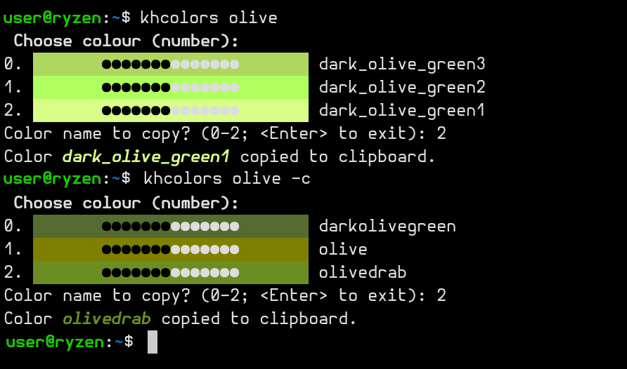
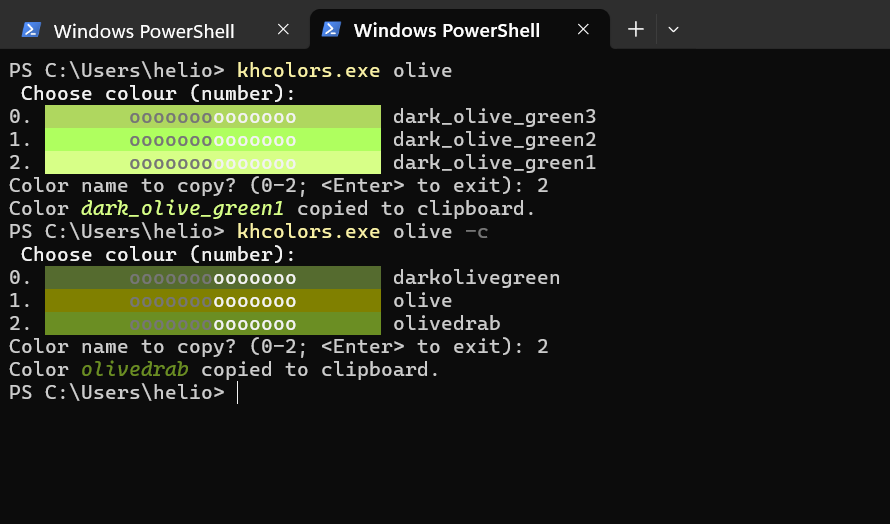

# khcolors 🎨
> Searching for colour names

<!-- [![NPM Version][npm-image]][npm-url]
[![Build Status][travis-image]][travis-url]
[![Downloads Stats][npm-downloads]][npm-url] -->

<!-- One to two paragraph statement about your product and what it does. -->
The application helps choosing a colour name from rich or CSS4 palettes. Presents a list of all the colours containing name given as a parameter.


<!--
## Installation

OS X & Linux:

```sh
npm install my-crazy-module --save
```

Windows:

```sh
edit autoexec.bat
```
-->

## Build, install

```sh
cd khcolors
hatch build
pip install .
```

## Usage example

<figure>
    <figcaption>khcolors, usage: on linux mint, in kitty</figcaption>
    
</figure>

<br/>


<figure>
    <figcaption>khcolors, usage: on windows, in powershell</figcaption>
    
</figure>

<!--
## Development setup

Describe how to install all development dependencies and how to run an automated test-suite of some kind. Potentially do this for multiple platforms.

```sh
make install
npm test
```
-->

## Release History

* 0.1.1
    * Minor change of the result message
* 0.1.0
    * First working version of the package
* 0.0.1
    * Work in progress

## Meta

<!--
khaz – [@YourTwitter](https://twitter.com/dbader_org) – YourEmail@example.com
-->
khaz –  pykhaz@o2.pl

Distributed under the MIT license. See [LICENSE](LICENSE.txt) for more information.

[https://github.com/heliotech](https://github.com/heliotech/)


<!-- Markdown link & img dfn's -->
<!--
[npm-image]: https://img.shields.io/npm/v/datadog-metrics.svg?style=flat-square
[npm-url]: https://npmjs.org/package/datadog-metrics
[npm-downloads]: https://img.shields.io/npm/dm/datadog-metrics.svg?style=flat-square
[travis-image]: https://img.shields.io/travis/dbader/node-datadog-metrics/master.svg?style=flat-square
[travis-url]: https://travis-ci.org/dbader/node-datadog-metrics
[wiki]: https://github.com/yourname/yourproject/wiki
-->
